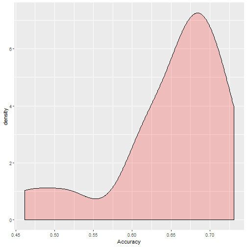

## What is Linear Regression?

- Statistical model used to identify a relationship between a predictor, $x$, and a response, $y$.
- Linear regression identifies a line of best fit between the predictor and the response.
- Not only can we identify relationships between $x$ and $y$, we can also predict future relationships using the regression line. 

---

## The Linear Regression Equation

$\hat{y} = b_{0} + b_{1}x + i$

- $\hat{y}$ is the predicted value of the dependent variable
- $b_{0}$ is the y-intercept term 
  + This is what $\hat{y}$ equals when $x$ is 0
- $x$ is the value of the independent variable
- $b_{1}$ is the slope (referred to as the coefficient) of x
  + For every 1 unit increase in $x$, $\hat{y}$ increases by $b_{1}$
- There is also random error, $i$, that encapsulates the randomness that the model can't catch

---

## Ordinary Least Squares

- Goal is to identify coefficients that minimize the sum of squared differences between the actual and predicted y values
  + Also known as residuals
- A perfect model would have no difference between actual values and predictions
- Influential outliers can have a large impact on the line of best fit

---

## Developing a Linear Model in R

- In R, we can use `lm()` to develop a linear regression model
- We use the `y ~ x` formula interface while specifying the data we are using
- We need to call `summary()` to see model output


```r
pres.lm1 <- lm(prestige ~ education, data = prestige)
```

---

## Model Output in R

- First we get the spread of the residuals
- The residual is the difference between actual and predicted y-value
- Next we get coefficient info
  + Slope estimates, standard error, and p-values
- The final block of text includes several additional pieces of model information, mainly used to validate our model

---

## Coefficient Estimates


```r
coefficients(pres.lm1)
```

```
## (Intercept)   education 
##  -10.731982    5.360878
```

- The coefficient estimates are the constants of the linear regression formula
- In this case, our model would look as follows:
 + $\hat{y} = -10.732 + 5.361(x)$
- The intercept value suggests that when education is `0`, our predicted value for prestige is `-10.732`
- The education estimate suggests that for each additional point of education, prestige increases by `5.361`

---

## How Good is Our Model???

- The R-squared value is a measure between `0` and `1` showing how much variance the model explains
  + The closer the value is to `1`, the more the model explains
- Mathematically, it's `1` minus the ratio of the sum of squared errors and the total sum of squares
  + SST is the total error between the mean of y and its specific observations
  + SSE is the unexplained error; the difference between the prediction and the observations
- The F-value explains whether the model fits the data better than random guessing
  + Random guessing would just be predicting the mean value of y for all observations

---

## Linear Regression Assumptions

- Normality of Residuals: use a QQ plot to determine normality of model residuals
- Constant Variance: variance of the residuals are the same for different values of x
- Linearity: Relationship between `x` and `y` is linear
- Independent observations: observations don't influence each other

---

## Normality

- We can use a QQ plot to determine if our residuals follow a normal distribution
- The points should follow along the straight QQ line
  + This line represents perfectly normal data; don't expect all of your residuals to follow it exactly

---

## Normality


```r
qqnorm(pres.lm1$residuals)
qqline(pres.lm1$residuals)
```



---

## Constant Variance and Linearity

- We can check out constant variance and linearity by plotting residuals vs. fitted values
- If the points are spread out evenly around `0`, we can assume constant variance
- If the points show no real pattern or trend, sticking close to `0`, we can assume linearity

---

## Constant Variance and Linearity


```r
scatter.smooth(pres.lm1$fitted.values, pres.lm1$residuals)
```


---

## What if Our Model Doesn't Meet Assumptions?

- It doesn't necessarily mean we have a bad model, it just means that we could improve upon it
- Can improve through transforming variables, getting additional data, or even going with a non-linear model!

---

## Making Predictions

- One of the benefits of linear regression is that we can predict new data
- Use the `predict()` function to make these predictions
  + The first argument should be the name of the model
  + Without additional arguments, this will just predict on the data used to train the model
  + Specify the argument `newdata = x` where x is the new data to make additional predictions

---

## Linear Regression with Categorical Data

- Categorical data is treated a little differently than numeric data
- Categorical data are treated as dummy variables
  + Acting as a numeric flag for the different categories

---

## Coefficient Output of a Categorical Predictor


```r
pres.lm2 <- lm(prestige ~ type, data = prestige)

coefficients(pres.lm2)
```

```
## (Intercept)    typeprof      typewc 
##   35.527273   32.321114    6.716206
```

- The first factor level is represented by the intercept
  + Baseline or reference level
- The coefficients of the other two factor levels would be added to the intercept if the observation is one of those levels; if it is the baseline level, nothing is added
