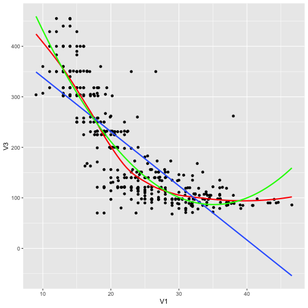

## Expanding on Simple Linear Regression

- A lot of the time you’ll have access to several variables you can use to develop a model
- Adding additional variables can have a positive on a regression model to a degree
- Adding too many can cause our model to overfit the data
- There are additional assumptions and things to take into account when dealing with multiple independent variables

---

## Developing a Linear Model with Multiple Variables

- Like in simple linear regression, we use `lm()` and R’s formula interface to develop a linear model
- To add additional independent variables to the formula interface, we use a `+` 
- Think about variables that you are putting in the model… does their relationship with the response make sense?
 + Adding too many independent variables to our model can cause it to overfit our data, creating issues in predicting future values

---

## What Does our Output Mean?

- Our summary output is very similar to the output in simple linear regression
- Coefficient estimates are the change in y with each additional unit of `x` WITH all other independent variables held constant
- R squared never decreases with each additional variable
  + Adding variables of little to no importance can inflate our R squared value
  + Adjusted R squared takes into account the number of variables in the model and penalizes additional variables that don’t improve the model

---

## Model Assumptions

- The assumptions from simple linear regression apply to multiple regression
- In addition, we have to think about multi-collinearity
  + This is when our independent variables are highly correlated amongst each other
  + Doesn’t necessarily cause issues with predictions or adjusted R squared
  + Does mess with our coefficients, making relationships difficult to interpret

---

## Detecting and Dealing with Multicollinearity

$$VIF_k = \frac{1}{1 - R^2_k}$$
- The variance inflation factor can detect high collinearity
  + Use the `vif()` function from the `car` library
- VIF values above `10` indicate a variable with strong collinearity; above `5` could also signal problems
- Essentially the VIF is looking at how well the independent variables can be used to predict each other
- Adjust for multi-collinearity by combining correlated variables or removing them from the model altogether

---

## Comparing Nested Models

- We can use a partial F-test to see if a complex model is significantly better than a simple model that uses a subset of the variables in the complex model
- Is the improvement created by developing a more complex model actually substantial enough to warrant making the model more complex?
- Run `anova()` using both models as your arguments
- A p-value less than alpha `.05` indicates that our full, complex model significantly improves on the reduced model

---

## Okay, So Now What?

- Linear regression is a good introduction to the modeling process, but it has issues
  + There are a lot of things that we want to model that aren’t linear
  + Being a parametric model, linear regression has a lot of assumptions
- What can we do to make linear models more flexible and address assumption issues?

---

## Words of Caution

- When relationships between variables start becoming much more advanced than a linear model can determine, might be easier to go non-parametric route
  + Ensemble tree models: boosting, random forest
- These non-parametric approaches don’t need to meet a laundry list of assumptions
- They can better identify non-linear patterns and complex interactions
- Their main con: difficult to explain results to others

---

## Transforming the Response

- Sometimes the response isn’t normally distributed
  + This can lead to issues in residual normality
  + Can lead to non-constant variance
  + Common issue when predicting monetary values

---

## Box-Cox Transformation

- Searches all possible values of lambda for the one that has the lowest error
- Instead of looking at the lambda that produces the most normal y, look at the range to see if it includes a more common value
  + Using a specific lambda can make our results more confusing

---

## Common Box-Cox Transformations


```
## # A tibble: 7 x 2
##   lambda Y_transformation
##    <dbl> <chr>           
## 1   -2   1/(Y^2)         
## 2   -1   1/Y             
## 3   -0.5 1/sqrt(Y)       
## 4    0   log(Y)          
## 5    0.5 sqrt(Y)         
## 6    1   Y               
## 7    2   Y^2
```

---

## Maybe Your Data Isn't Linear

- Linear regression is fitting a straight line relationship through your data
- Maybe your data has a curved relationship
  + Polynomial Regression
- Maybe your data has a complicated, hard to determine relationship (maybe a sin wave)
  + Splines
- Maybe your data is categorical
  + Logistic Regression

---

## Polynomial Regression

- If we see a curved relationship between our predictor and response we can use polynomial regression to get a better fit
- If we miss the curved relationship in the initial graphs, we can also identify it in the residuals vs. fitted plot

---

## Polynomial Regression



---

## Polynomial Regression

- Polynomial regression can take on different degrees
  + 2 is quadratic, 3 is cubic; not suggested going beyond cubic to avoid overfit
- Each coefficient is an additional degree; for example, consider a model predicting salary by age to the second degree.
  + $Predicted Salary = B_0 + B_1(age) + B_2(age^2)$
- `poly()` can be used to take the polynomial in R
  + Specify degree=x to set degree
  + Orthogonal or raw return… What’s the difference?
